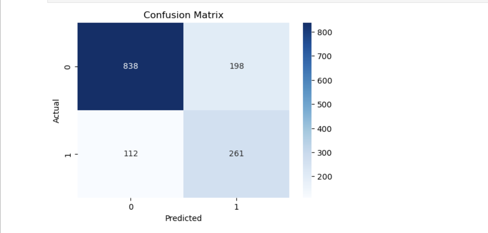
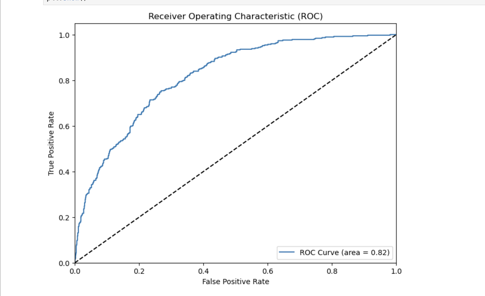
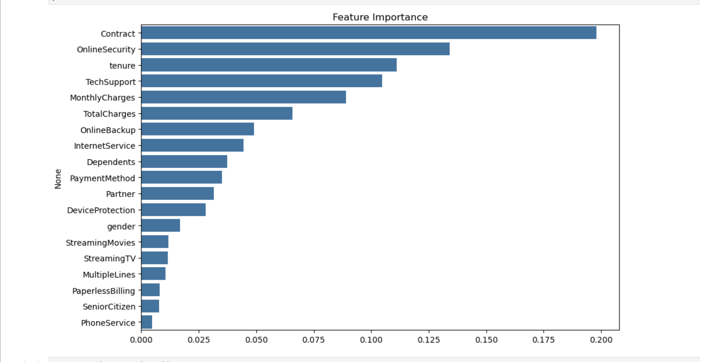

# 🔁 Telco Customer Churn Prediction

Predicting which telecom customers are likely to churn using machine learning and actionable insights.

---

## 📌 Project Overview

Customer churn is a critical issue in the telecom industry. In this project, we use machine learning to:

- Predict whether a customer is likely to churn
- Help telecom companies take proactive action to retain customers

We applied a Random Forest Classifier after handling class imbalance with SMOTE. The model achieved strong performance with **~76% accuracy** and **~65% recall** on churners.

---

## 📊 Dataset

- **Source**: [Kaggle – Telco Customer Churn](https://www.kaggle.com/datasets/blastchar/telco-customer-churn)
- **Size**: 7,000+ records
- **Features**: Demographics, contract type, payment methods, tenure, and more

---

## 🛠️ Tools & Tech

- Python (Pandas, NumPy)
- Scikit-learn
- Matplotlib, Seaborn
- SMOTE (imbalanced-learn)
- Jupyter Notebook

---

## 🔬 Workflow Summary

### 🧹 Data Cleaning & Prep
- Converted `TotalCharges` to numeric
- Dropped rows with missing values
- Label encoded categorical features
- Removed non-predictive fields like `customerID`

### ⚖️ Class Imbalance
- Used **SMOTE** to oversample minority (churn) class
- Helped boost recall for churn predictions

### 🤖 Model Training
- Random Forest Classifier with class weighting
- Tuned with GridSearchCV (offline)
- Evaluated with standard classification metrics

---

## 📈 Results

| Metric             | Value     |
|--------------------|-----------|
| Accuracy           | ~76%      |
| Precision (Churn)  | ~54%      |
| Recall (Churn)     | ~65%      |
| F1-Score (Churn)   | ~0.59     |

---

## 📊 Visualizations

### 📉 Confusion Matrix  

### 📈 ROC Curve  

### 🔍 Feature Importance  

---

## 📄 Final Report

A polished, human-readable report is included in this repo:  
📎 **[Customer_Churn_Final_Report.pdf](Customer_Churn_Final_Report.pdf)**

---

## 🔮 Next Steps

- Use **SHAP** for model interpretability
- Try **XGBoost** or **LightGBM**
- Add **business cost-benefit analysis**
- Build a **Streamlit app** (future work)

---

## ✍️ Author

**Felix Stephen Aidoo**  
🎓 MSc Data Science | 📊 Data & AI Enthusiast  
🔗 [LinkedIn](linkedin.com/in/felix-s-aidoo) | 💻 [GitHub](https://github.com/YFelix-Aid)
